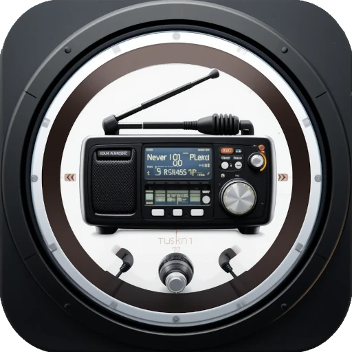

[](https://www.buymeacoffee.com/armysarge)

[](https://www.python.org/)

[](https://opensource.org/licenses/MIT)
[](https://github.com/armysarge/rigranger-client/issues)

# RigRanger Client

<div align="center">
  
</div>

## Overview

RigRanger Client is a modern, cross-platform application designed to remotely control your amateur radio over the network. It connects to the RigRanger Server running on your radio-connected computer, creating a network proxy that allows you to operate your radio as if it were directly connected to your computer. The client uses Hamlib's network protocol, making it compatible with hundreds of different radio models.

### Key Features

- 🎛️ **Remote Radio Control** - Operate your radio from anywhere on your network
- 🔊 **Real-time Audio Streaming** - Listen to and transmit audio with minimal latency
- 📡 **Hamlib Network Proxy** - Access the remote radio using Hamlib's network protocol
- 🖥️ **Cross-Platform Support** - Works on Windows and Linux operating systems
- 🛡️ **Secure Connection** - Encrypted communications with the server
- 📊 **Status Monitoring** - Real-time monitoring of radio parameters

## Requirements

- Computer running RigRanger Server connected to a Hamlib-compatible radio
- Node.js (v14 or higher)
- Windows (10/11) or Linux (Ubuntu 20.04+) operating system
- Network connectivity to the server

## Installation

### Download Prebuilt Packages

The easiest way to install RigRanger Client is to download the prebuilt packages from the [Releases page](https://github.com/RigRanger/RigRanger-Client/releases).

#### Windows

1. Download the `RigRanger-Client-Setup-x.x.x.exe` file
2. Run the installer and follow the prompts
3. Launch the application from your Start menu

#### Linux

1. Download the `RigRanger-Client-x.x.x.AppImage` file or `.deb` package
2. Make the AppImage executable: `chmod +x RigRanger-Client-x.x.x.AppImage`
3. Run the application: `./RigRanger-Client-x.x.x.AppImage`

### Building from Source

If you prefer to build from source:

```bash
# Clone the repository
git clone https://github.com/RigRanger/RigRanger-Client.git
cd RigRanger-Client

# Install dependencies
npm install

# Development mode
npm run dev

# Build for production
npm run build

# Package for distribution
npm run dist
```

## Usage

1. Launch RigRanger Client
2. Enter the IP address and port of the RigRanger Server
3. Specify the Hamlib network port (default: 4532)
4. Click "Connect"
5. Once connected, you can control the radio using the built-in radio controls
6. You can also connect third-party applications to the local Hamlib proxy

## Configuration

### Server Connection

Enter the IP address or hostname and port of the RigRanger Server. By default, the server uses port 8080.

### Hamlib Network Settings

The client creates a Hamlib network proxy that forwards commands to the remote radio. You can connect any software that supports Hamlib's rigctl protocol to this local proxy port.

These applications can then control the remote radio as if it were connected directly to your computer:

- WSJT-X
- FLdigi
- Ham Radio Deluxe
- N1MM Logger+
- And many more!

## Development

RigRanger Client is built using:

- Electron for cross-platform desktop functionality
- React for the user interface
- Socket.IO for real-time communication
- SerialPort for radio connectivity
- WebAudio API for audio streaming

### Project Structure

```
RigRanger-Client/
├── build/             # Compiled application
├── dist/              # Distribution packages
├── public/            # Static assets
├── src/
│   ├── components/    # React components
│   ├── main.js        # Electron main process
│   ├── preload.js     # Electron preload script
│   ├── App.js         # Main React component
│   └── index.js       # Application entry point
└── package.json       # Dependencies and scripts
```

## Contributing

Contributions are welcome! Please feel free to submit a Pull Request.

1. Fork the repository
2. Create your feature branch: `git checkout -b feature/amazing-feature`
3. Commit your changes: `git commit -m 'Add some amazing feature'`
4. Push to the branch: `git push origin feature/amazing-feature`
5. Open a Pull Request

## License

This project is licensed under the MIT License - see the [LICENSE](LICENSE) file for details.

## Related Projects

- [RigRanger-Server](https://github.com/RigRanger/RigRanger-Server) - Server application for hosting your radio

## Contact

If you have any questions or feedback, please open an issue on our [GitHub repository](https://github.com/RigRanger/RigRanger-Client/issues).

---

<div align="center">
  Made with ❤️ for Amateur Radio operators
</div>
